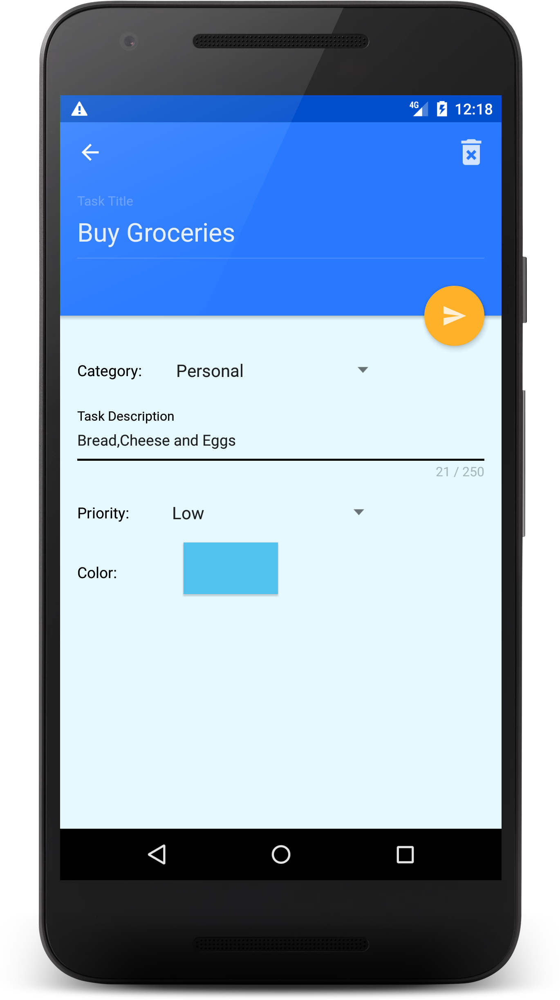
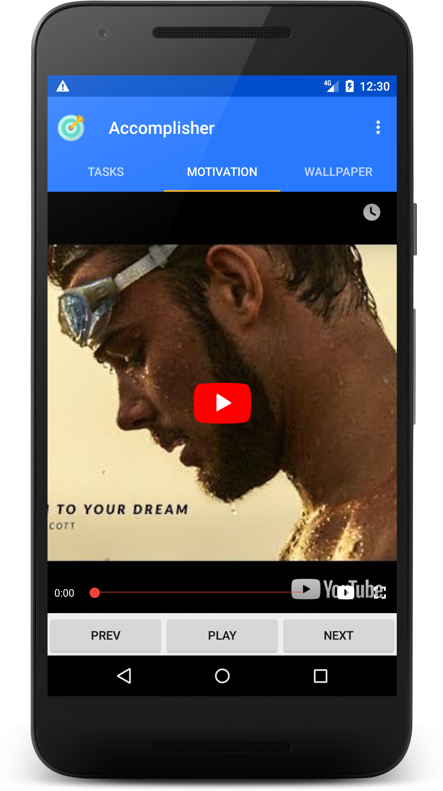
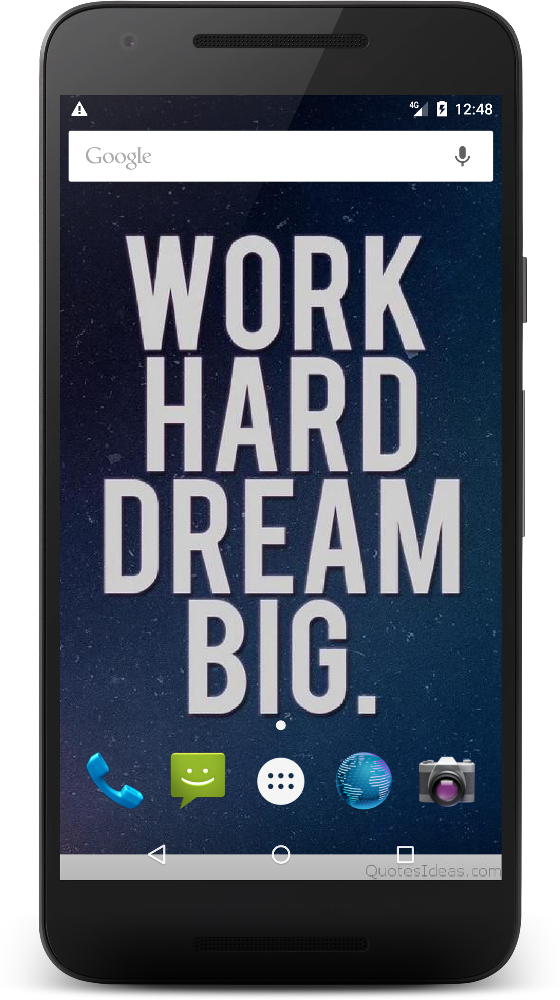

# Accomplisher
  
A motivational app where you can add your daily tasks,watch motivational videos, set motivational wallpapers and upload your own favourite wallpapers.
# Screenshots:

## Download
App Download Link: 
[Accomplisher.apk](https://drive.google.com/uc?authuser=0&id=1w7Xr07s1A-5RvNrgz5VE0ffbB8y95LCi&export=download)

App Demo: [Demo](https://www.youtube.com/watch?v=6c6mMyE1v7c)

License
-------
    Copyright 2019 Accomplisher
    
    Licensed under the Apache License, Version 2.0 (the "License");
    you may not use this file except in compliance with the License.
    You may obtain a copy of the License at
    
       https://www.apache.org/licenses/LICENSE-2.0
    
    Unless required by applicable law or agreed to in writing, software
    distributed under the License is distributed on an "AS IS" BASIS,
    WITHOUT WARRANTIES OR CONDITIONS OF ANY KIND, either express or implied.
    See the License for the specific language governing permissions and
    limitations under the License.
